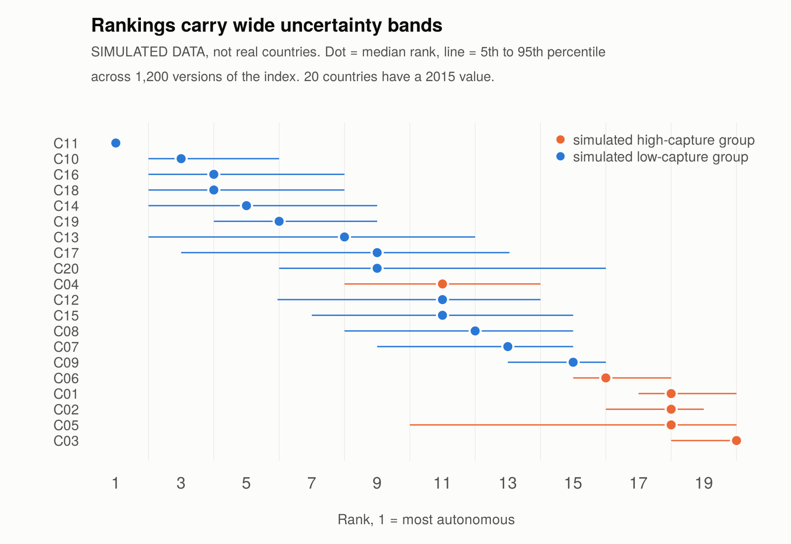
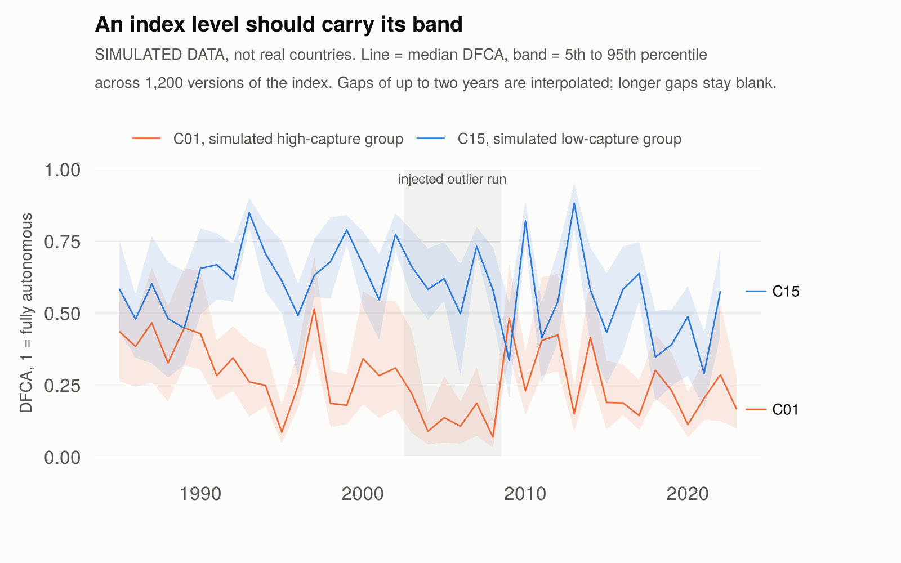

# DFCA: a de facto central bank autonomy index

R code to build a de facto index of central bank autonomy from central bank balance-sheet data, with uncertainty bands, diagnostics and a test harness.

> **Status: reference implementation, tested on simulated data only.** No result for a real country has been produced with this code. The raw balance-sheet series have not yet been collected, so the first job is the coverage audit described below. The figures in this README come from a simulated panel and say so.



## What it measures

The index asks how far a central bank is, in practice, used as an instrument of government finance. That is different from statutory independence, which records what the law permits, and from governor turnover, which records how often the executive changes the leadership. A bank can be legally protected, led by a long-serving governor, and still be financing the treasury.

The construct is behavioural. A bank has low de facto autonomy to the extent that its balance sheet shows it lending to government and to state-linked entities, financing deficits by creating base money, and doing so where its own statute forbids it.

Every raw indicator is oriented so that higher means more fiscal capture. The published index is `DFCA = 1 − capture`, on [0, 1], with higher meaning more autonomy, so it runs in the same direction as de jure indices such as the CBIE index.

## Indicators and dimensions

| Dimension | Indicator | Definition |
|---|---|---|
| direct | `ncg_gdp` | Net claims on central government, share of GDP (stock) |
| direct | `dncg_gdp` | Annual change in net claims on central government, share of GDP (flow) |
| quasi-fiscal | `cos_gdp` | Claims on other sectors, including public non-financial corporations, share of GDP |
| monetisation | `cb_contrib` | Contribution of central bank credit to government to base-money growth |
| compliance | `breach` | 1 if net lending to government is positive in a year when the statute prohibits it |

Scale balance-sheet items by GDP in current local currency, not dollars. Use net rather than gross claims on government, or a government holding large deposits at the central bank will look heavily financed by it.

Five indicators in four dimensions is deliberate: each dimension is a different channel, so the aggregation has work to do.

## Quick start

Tested with R 4.3.3. No packages beyond base R.

```r
source("build_index.R")

# df: one row per country and year, columns as in data_template.csv
df  <- read.csv("my_panel.csv")

audit <- coverage_audit(df)        # do this first: where are the usable runs?
idx   <- build_index(df)           # the index, its four dimension scores, capture and dfca
dg    <- diagnostics(idx)          # correlations, PCA, within-country variance

sens  <- sensitivity(df, reps_weights = 200)   # 12 specifications x 200 weight draws
rb    <- rank_bands(sens, year_sel = 2015)     # rank with 5th to 95th percentile
lb    <- level_bands(sens, "ZWE")              # level over time for one country
```

To check that everything works on your machine, run the test harness. It simulates a panel and stops with an error if any check fails:

```
Rscript test_simulate.R
```

To redraw the two figures: `Rscript demo_figures.R`.

## What the code does

1. **Orientation.** Every indicator signed so that higher is more capture.
2. **Winsorising** at the 1st and 99th percentiles of the pooled distribution. In the simulated test an outlier run pushed the maximum of `ncg_gdp` to 90.5; after winsorising it is 8.8. Without this, one country defines the scale.
3. **Normalisation** to [0, 1]: min-max (baseline), rank, or the normal CDF of the z-score. Pooled across countries unless `within_country = TRUE`.
4. **Within-dimension aggregation:** arithmetic mean (baseline).
5. **Across-dimension aggregation:** geometric mean (baseline), with equal weights.
6. **Sensitivity:** every combination of three normalisations, two within-dimension rules and two across-dimension rules, each with random weights from a Dirichlet distribution. The result is a set of index versions, from which `rank_bands()` and `level_bands()` report medians and 5th to 95th percentile bands.
7. **Diagnostics, coverage and missing data:** `diagnostics()`, `coverage_audit()`, `coverage_matrix()`, `impute_within_country()`.
8. **Validation:** `validate()` correlates the index with external measures and tests whether it adds explanatory power for inflation beyond a de jure index.

The same code builds other indices. Pass a different `dims` list, for example `build_index(df, dims = DFCA_DIMS_CORE)` for the two-indicator reduced core.

## Design choices that move the numbers

**The geometric mean is taken over autonomy, not capture.** The reason to prefer a geometric mean here is that a bank should not offset heavy monetisation with a clean record on other dimensions. That holds when the mean is taken over autonomy scores: one dimension of full capture drags autonomy down and the others cannot offset it. Taken over capture scores the effect reverses, because a clean dimension drags the capture average down. In this code `aggregate_capture()` applies the geometric rule to `1 − capture`.

| Case | DFCA, arithmetic | DFCA, geometric |
|---|---|---|
| Three dimensions fully captured, one clean | 0.25 | 0.09 |
| All four dimensions at 0.5 | 0.50 | 0.50 |
| Fully autonomous | 1.00 | 1.00 |
| Fully captured | 0.00 | 0.00 |

**The geometric mean needs a floor.** A geometric mean is zero if any score is zero, and min-max normalisation always produces zeros, so one bad dimension would collapse the index. Scores are therefore shifted into [`geo_floor`, 1] before the mean and shifted back afterwards. Zero stays zero and one stays one. The default is 0.1. It is a choice, and on the simulated panel it matters:

| Across-dimension aggregation | Correlation of capture score with the known latent factor | Median DFCA |
|---|---|---|
| Arithmetic | 0.760 | 0.603 |
| Geometric, floor 0 | 0.549 | 0.545 |
| Geometric, floor 0.05 | 0.679 | 0.551 |
| Geometric, floor 0.10 (default) | 0.701 | 0.556 |
| Geometric, floor 0.25 | 0.731 | 0.568 |

The simulated latent factor is additive in every indicator, which favours the arithmetic mean. The simulation therefore cannot say which aggregation is right for a real central bank. That is a substantive judgement, and the sensitivity analysis reports both.

**Equal weights are a choice.** They reflect that no theory ranks the four channels. Random Dirichlet weights drive the sensitivity analysis. Weights from the first principal component, and a benefit-of-the-doubt weighting, are not yet implemented.

**Rankings are less precise than they look.** With 20 simulated countries and 16 of them observed in 2015, the median width of the 90% rank interval is 4 positions out of 16. Present levels with bands, use the index as a continuous regressor, and do not claim one country is more captured than another unless their intervals do not overlap.



## What the simulated test shows

20 countries, 1985 to 2023, a known latent capture factor, an outlier run in one country and 8% of cells missing at random in each indicator.

| Check | Result |
|---|---|
| Recovery of the latent factor | Correlation 0.70 between the capture score and the factor, with noise and missingness |
| Dimension structure | Pairwise correlations 0.28 to 0.49; first principal component 53%, loadings 0.44 to 0.56. Related but not redundant |
| Listwise loss | 511 of 780 country-years survive: 8% item missingness costs 34% of the sample |
| Reduced core | Two indicators (`ncg_gdp`, `cb_contrib`) give 661 usable country-years and correlate 0.70 with the full index where both exist |
| Within-country variance | 60% of the variance of DFCA lies within countries, so there is within-country movement for a fixed-effects model to use |
| Rank precision | Median 90% interval 4 positions out of 16 countries ranked in 2015 |

The validation check regresses simulated inflation on a simulated de jure index and DFCA. Both are built from the same latent factor, so it is circular by construction. It shows the validation code runs, not that the index is valid.

## What is not done

- **Real data.** The first job is the coverage audit: a country-by-year matrix of non-missing values for the five indicators, for the focus countries and the wider sample. Use `coverage_audit()` and `coverage_matrix()`. If coverage is continuous from the 1980s a panel design stands. If it is patchy before 2000, a shorter panel with a longer case study is the better design.
- **Deriving the indicators.** `dncg_gdp`, `cb_contrib` and `breach` are derived from the balance sheet and the statute. Their exact definitions, and the reading of each country's lending rule for `breach`, are still to be settled.
- **Structural breaks.** Standardised Report Form adoption, redenominations and GDP rebasing change reported ratios. Record them and pass them to `impute_within_country()` so nothing is interpolated across a break.
- **Validation on real data:** against turnover-based measures, against the de jure index (especially its lending-limitation component), and on episodes that are documented independently.
- **Alternative weights:** first-principal-component and benefit-of-the-doubt.

## Data sources to use

Statutory independence: the CBIE index (cbidata.org, Romelli) and the extended index in Garriga (2025), *International Studies Quarterly* 69(2). Balance-sheet series: IMF monetary statistics (central bank survey). Governor turnover: replication files of Dreher, Sturm and de Haan, and Strong and Yayi (2023). Controls: World Development Indicators and IMF IFS. This repository holds no data from any of them.

## Files

| File | Purpose |
|---|---|
| `build_index.R` | The implementation |
| `simulate_panel.R` | Builds the simulated panel used by the tests and figures |
| `test_simulate.R` | Runs every component on simulated data and stops if a check fails |
| `demo_figures.R` | Draws the two figures above |
| `data_template.csv` | Column names the code expects |
| `CHANGES.md` | What differs from version 1.0 of the technical note |
| `.github/workflows/test.yml` | Runs the tests on GitHub on every change |

## Author

Dr Eddie Mahembe, Underhill Corporate Solutions. Released under the MIT licence. Please cite this repository if you use the code.
